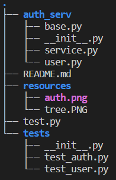

<div align="center">
  <br/><b>Authenticator</b>
</div>

<div align="center">
    A Simple Authentication Service prototyped in Python
</div>

<div align="center">
    <a href="#requirements"><b>Requirements</b></a> |
    <a href="#structure"><b>Structure</b></a> |
    <a href="#usage"><b>Usage</b></a> 
</div>

# Requirements

python >= 3  
  
No third party packages required.


# Structure
The project is organized below:  
<div>
    
</div>  

* Sources are stored in **auth_serv**  
    * base.py implemented an abstract class
    * user.py implemented the User class, inherited from base.py  
    * service.py implemented the main authenticate and authorize APIs
* Unittest are stored in **tests**  
    * test_user.py tested basic methods of the User class
    * test_auth.py tested different scenarios of authentication
* Icons are stored in **resources**  

# Usage 
Change to project directory:  
```shell
cd /home/user/auth_serv
```
Run all tests:
```shell
python test.py
```

